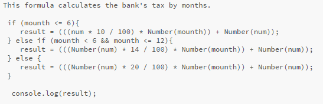

# CV of Elena Kuparadze

## Contact information

- **Phone:** +995568872828;
- **E-mail:** elenakuparadze@gmail.com

[*Linkedin*](https://www.linkedin.com/in/elena-kuparadze-5a0a8660/) 

## Briefly about myself:
I am Elena Kuparadze. I am from Georgia, Tbilisi.

I am a Junior Front-End Developer.

I am actively learning programming. I have big motivation and big wishes to become the professional full Stack developer.

My work experience generally covers 10 years.

Before I decided to learn programming, I was a successful HR manager for a large construction company.

In the month of December 2021, I left the position for one purpose. This goal is to learn programming and enter in this profession.

My time and energy is currently focused solely on programming.

This is a job that I enjoy doing and it brings me happiness.

👉👉I am currently work as Volunteer mentor at Oto's BitCamp

## Skills and Proficiency:
- HTML5, CSS3
- JavaScript Basics
- Git, GitHub
- VS Code
- Adobe Photoshop
- Figma

## Code example:

***This function from my last task in JavaScript***

***This formula calculates the bank's tax by months.***

## Project example:

[***Skilled e-learning landing page***](https://itsmeelo.github.io/Skilled-e-learning-landing-page/);

[***Project:"profile Card Component
" (HTML/CSS)***](https://itsmeelo.github.io/profile-card-component/);

[***Project:"Pig game" (HTML/CSS/JavaScript)***](https://itsmeelo.github.io/Pig-game/);

[***Project:"Modal Window" (HTML/CSS/JavaScript)***](https://itsmeelo.github.io/Modal-Window/index.html);

[***Project:"Guess My Number" (HTML/CSS/JavaScript)***](https://itsmeelo.github.io/Game-Guess-My-Number-/).

## Courses:

- Jonas Schmadmann - The Complite Javascript Course 2022: From zero to Expert! (InProgress)
- Andrei Neagoie - Zero to Mastery (full Stack) (In Progress)
- Sientific Cyber Security
Association.
Course: «Front-End
Developer»
(completed);

## Languages: 

- English - Intermediate (according to the online test at
www.efset.org
)

- Russian - Good
- Georgian - Native

**Elena Kuparadze**

[GitHub](https://github.com/Itsmeelo)
